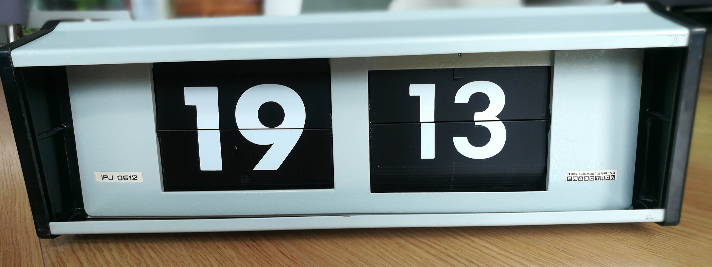
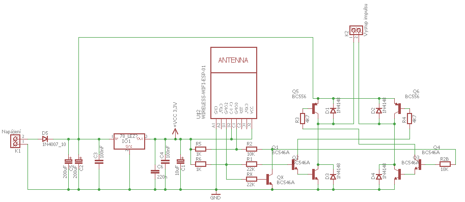
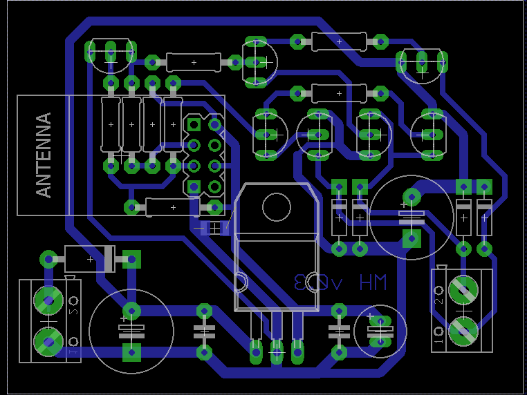
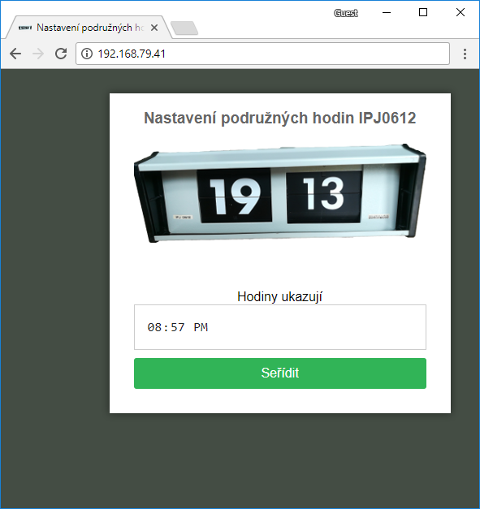
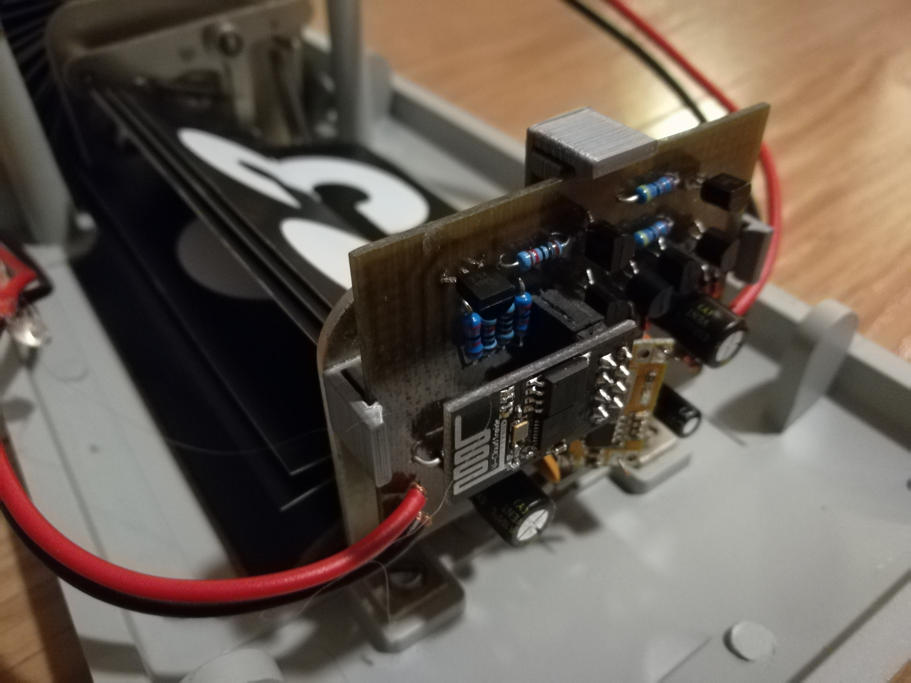
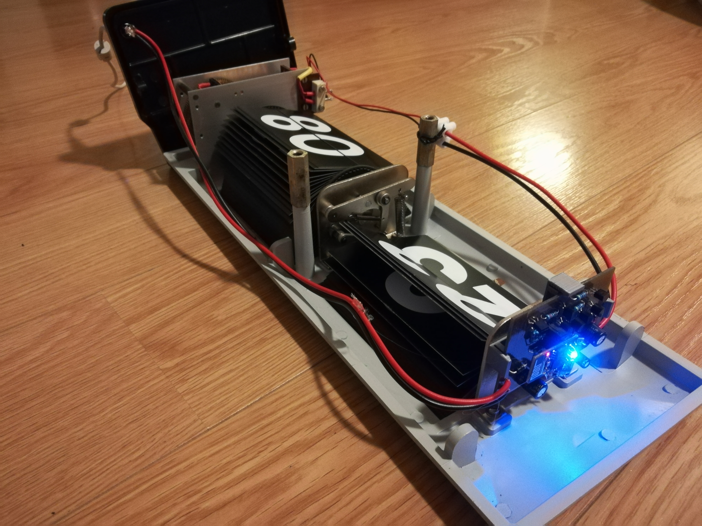

# Driving secondary clock by ESP8266

Check out this Youtube [video](http://www.youtube.com/watch?v=zKabXwngn9Y) to see the clock in work.

[](http://www.youtube.com/watch?v=zKabXwngn9Y)

## Intro

I have received this beautiful secondary clock [IPJ0612](https://www.pragotron.sk/?ukaz=content/ipj0612) produced by Czech company Pragotron in 80's. Secondary here means that the clock is only a "display" and has to receive signals from a central clock to move by one minute.


The clock is driven by kind of a stepper motor, powered by 24V. It has two wires as input directly connected to the coil. For one half turn an impulse of 24V is required for the remaining half turn -24V are applied.


## Electronics

We needed to use a circuit that can revert the voltage on its output. Two inputs are connected to ESP8266 GPIOs (GPIO0 and GPIO2). GPIO0 set to high makes 24V on output. Setting GPIO2 high causes -24V on output. A pull-up resistors are connected to GPIOs so that ESP8266 boots in desired 'normal operation' mode. A protection transistor (QX on the scheme) for accidental highs on both inputs has been added. The ESP8266 ESP-01 version is used.

We have used Eagle to draw the [scheme](./hw/driver.sch) and design the [board](./hw/board.sch).



To get the 3.3 voltage to power the ESP8266 a LM1085IT-3.3 TO220 regulator is used.
In my implementation, I'm using step-down module as I had one spare at home (the component with annoying blue LED on the pictures below). It's sold on eBay and can be found as [3A 9V/12V/19V To 3.3V DC-DC USB Step Down Buck Power Supply Module For Car](https://www.ebay.com/sch/i.html?_odkw=2pcs+3A+9V%2F12V%2F19V+To+3.3V+DC-DC+USB+Step+Down+Buck+Power+Supply+Module+For+Car&_osacat=0&_from=R40&_trksid=p2045573.m570.l1313.TR0.TRC0.H0.X3A+9V%2F12V%2F19V+To+3.3V+DC-DC+USB+Step+Down+Buck+Power+Supply+Module+For+Car.TRS0&_nkw=3A+9V%2F12V%2F19V+To+3.3V+DC-DC+USB+Step+Down+Buck+Power+Supply+Module+For+Car&_sacat=0). 

## Programming

I am using NodeMCU Lua ([https://github.com/nodemcu/nodemcu-firmware](https://github.com/nodemcu/nodemcu-firmware)) to program the ESP8266. The programming in Lua is very easy so the core program can have less than 140 lines including the web server used to adjust the clock.

A [NodeMCU custom builds](https://nodemcu-build.com/) tool can be used to compile the binary for ESP8266. Beside standard modules the following modules are used: `cron, enduser_setup, rtctime, sntp`. I have used the integer version of the firmware is used. Though float version should be fine too.

I am using [ESP8266 Flasher](https://github.com/nodemcu/nodemcu-flasher) to flash the binary.

To upload Lua files and files used by the web server the [ESPlorer](https://esp8266.ru/esplorer/) GUI can be used.

The program connects to the WIFI, regularly synchronizes time via NTP and sends 300ms to GPIO0 and GPIO1 alternately. To show correct time ESP needs to know what time the clock is showing at startup so it can set it to actual time. This can be adjusted in web browser as the ESP8266 is running a web server. Otherwise the clock assumes correct time is displayed and sends signals as time goes on.

It exposes also a telnet server so an OTA-like update of Lua codes can be performed.



In my implementation am using only 18V to run the clock (a power adapter from an old printer). With 24V the signal could probably be shorter than 300ms so clock adjustment would be faster.

The source code is in the folder [lua_code](https://github.com/vsky279/secondary-clock-ESP8266/tree/master/lua_code).

## Assembly

A 3d printed [holder](./holder/holder.skp) (designed in SketchUp) and double face duck tape has been used to mount the board inside the clock. An [STL file](./holder/holder.stl) is usually used in the slicer software.



I have also designed a cap to cover the hole of the original connector ([SketchUp file](./hw/holder/cap.skp) and [STL file](./holder/cap.stl)) - not shown on any of photos.

## Modifying config on the fly

```
file.open('config.lua')
file_read_cache=file.read()
file.close()
print(file_read_cache)

file_write_cache=file_read_cache:gsub('IMPULSE = 250','IMPULSE = 350')
print(file_write_cache)

for k,v in pairs(file.list()) do 
 print("File Name: " .. k .. " Size: " .. v)
end

file.open("config2.lua", "w")
file.writeline(file_write_cache) 
file.close()

file.open('config2.lua')
file2_read_cache=file.read()
file.close()
print(file2_read_cache)

file.remove('config.lua')
file.rename('config2.lua','config.lua')
```
